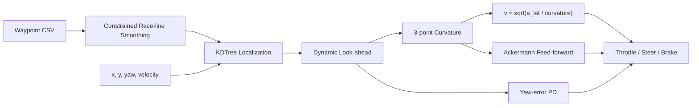

# 모바일시스템제어 텀프로젝트

> CARLA와 ROS 2를 이용해 주어진 트랙을 빠르고 안정적으로 완주하는 자율주행 레이싱 제어기를 설계한 성균관대학교 「모바일시스템제어(EME3081)」 텀 프로젝트

- 기간: 2025.12
- 환경: Ubuntu 20.04, ROS 2 Foxy, CARLA, Python
- 공통 인터페이스: `/mobile_system_control/ego_vehicle` → `/mobile_system_control/control_msg`

## 같은 프로젝트의 두 구현

공동 프로젝트의 기존 구현과 `MSC_RacingSimul`은 같은 과제·트랙·ROS 2 인터페이스를 사용하며, 서로 다른 제어 전략과 검증 방법을 적용했습니다.

| 구분 | 기존 공동 프로젝트 자료 | MSC_RacingSimul |
| --- | --- | --- |
| 횡방향 제어 | Stanley — heading error + cross-track error | 동적 look-ahead 목표점 + yaw-error PD |
| 종방향 제어 | PID + 목표 가속도 feed-forward | 곡률 기반 목표 속도 + throttle/brake 비례 제어 |
| 경로 | 시간 최소화 최적 궤적과 목표 속도·가속도 프로파일 | 반복 평활화와 도로 폭 제약으로 레이싱 라인 생성 |
| 최근접점 탐색 | NumPy 거리 계산 | SciPy KDTree |
| 검증 | CARLA 주행 로그와 랩타임 비교 | ROS 2 mock simulator와 Matplotlib 전역 트랙 뷰 |

## MSC_RacingSimul 제어 흐름

## 구현·개선 포인트

- 트랙 중심선을 평활화하되 도로 폭, 차량 폭, 안전 여유로 이탈 상한을 둡니다.
- 속도에 비례하는 look-ahead로 저속 응답성과 고속 안정성의 균형을 맞춥니다.
- 전방 곡률과 허용 횡가속도로 코너 목표 속도를 계산합니다.
- Ackermann 기반 조향 feed-forward와 yaw 오차 feedback을 결합합니다.
- mock simulator가 차량 상태 토픽과 제어 토픽을 그대로 연결해 제어 루프를 재현합니다.

## 코드와 자료

- [기존 공동 프로젝트 README](https://github.com/junmyounggyu/2026-autonomous-driving-hackathon-portfolio/blob/main/%EB%AA%A8%EB%B0%94%EC%9D%BC%EC%8B%9C%EC%8A%A4%ED%85%9C%EC%A0%9C%EC%96%B4%20%ED%85%80%ED%94%84%EB%A1%9C%EC%A0%9D%ED%8A%B8%20%28%EC%A0%84%EB%AA%85%EA%B7%9C%29/README.md)
- [기존 Stanley + PID/FF 제어 코드](https://github.com/junmyounggyu/2026-autonomous-driving-hackathon-portfolio/blob/main/%EB%AA%A8%EB%B0%94%EC%9D%BC%EC%8B%9C%EC%8A%A4%ED%85%9C%EC%A0%9C%EC%96%B4%20%ED%85%80%ED%94%84%EB%A1%9C%EC%A0%9D%ED%8A%B8%20%28%EC%A0%84%EB%AA%85%EA%B7%9C%29/racing_node.py)
- [MSC_RacingSimul 제어 노드](https://github.com/eriverOoO/MSC_RacingSimul/blob/main/src/my_racing_pkg/my_racing_pkg/racing_node.py)
- [MSC_RacingSimul mock simulator](https://github.com/eriverOoO/MSC_RacingSimul/blob/main/src/my_racing_pkg/my_racing_pkg/mock_sim.py)
