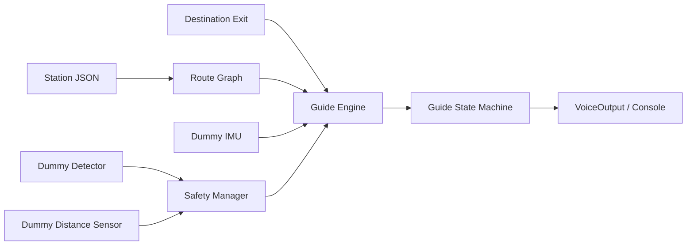

# 임베디드SW경진대회 — Metro Guide

> 시각장애인의 지하철 출구 이동을 보조하는 임베디드 AI 안내 디바이스를 목표로, 실제 하드웨어 연결 전에 전체 안내·안전 흐름을 검증하는 프로젝트

**현재 상태: 진행 중 / PC 시뮬레이션 프로토타입**

## 문제 정의

지하철 역사에서는 출구 경로가 복잡하고 엘리베이터·계단·개찰구·표지판 같은 랜드마크가 연속해서 등장합니다. Metro Guide는 목적 출구까지의 경로를 route node로 표현하고, 카메라·거리 센서 입력을 바탕으로 현재 구간을 완료했는지 판단해 음성 안내를 진행하도록 설계했습니다.

## 현재 구현

- 역별 출구·랜드마크·안내 문장을 JSON route graph로 관리합니다.
- `IDLE`, `WAITING_FOR_DESTINATION`, `GUIDING`, `DANGER`, `ERROR`, `ARRIVED`, `STOPPED` 상태를 구분합니다.
- confidence, 연속 감지 프레임 수, 화면 중앙 여부, bbox 면적을 route 진행 조건으로 사용합니다.
- 경로 진행보다 `SafetyManager`를 먼저 실행합니다.
- 장애물 거리, 카메라 가림·저텍스처, 흐림, 랜드마크 인식 실패를 별도 흐름으로 처리합니다.
- 실제 장비 없이도 정상, 장애물, 인식 실패 시나리오를 재현합니다.
- station 로딩, route 진행, 연속 프레임 조건, 위험 거리, 도착 상태를 pytest로 검증합니다.

## 안전 우선 설계

일반 안내 성공 여부와 안전 판단을 분리했습니다. 전방 거리가 위험 기준보다 작거나 영상 품질이 안내에 부적합하면 route node를 진행시키지 않고 `DANGER` 또는 `ERROR`로 전환합니다. detector가 잘못 인식한 한 프레임만으로 상태가 바뀌지 않도록 연속 감지 조건도 둡니다.

## 하드웨어 확장 경계

현재 저장소의 `adapters/`는 실제 장비 연동을 위한 교체 지점입니다.

| Adapter | 계획된 장비·기능 |
| --- | --- |
| `JetsonCameraStub` | Jetson Nano 카메라 프레임 캡처 |
| `YoloDetectorStub` | 랜드마크 YOLO 추론 |
| `ToFSensorStub` | 전방 장애물 거리 측정 |
| `IMUSensorStub` | 방향·움직임 측정 |
| `VoiceOutput` | 실제 TTS/스피커 출력으로 교체 |

Guide Engine은 vendor SDK 객체가 아니라 정규화된 detection·distance·orientation 값만 받으므로, 하드웨어 교체가 상태머신 전체 변경으로 번지지 않도록 구성했습니다.

## 기술 스택

`Python 3.10+` · `OpenCV(optional)` · `JSON` · `pytest` · 향후 `Jetson Nano / YOLO / ToF / IMU`

## 개발 현황

- 현재 perception과 센서는 dummy 구현이며 실제 YOLO 모델·Jetson·ToF·IMU는 아직 연결되지 않았습니다.
- 음성 출력은 실제 TTS가 아닌 콘솔 인터페이스입니다.
- 다음 단계는 실제 역 데이터 수집, 랜드마크 학습 데이터 정의, 센서 adapter 구현, 역사 환경에서의 안전성 시험입니다.

## 코드 근거

- [프로젝트 설명](https://github.com/eriverOoO/SubW_guide/blob/main/README.md)
- [Guide Engine](https://github.com/eriverOoO/SubW_guide/blob/main/src/metro_guide/core/guide_engine.py)
- [Safety Manager](https://github.com/eriverOoO/SubW_guide/blob/main/src/metro_guide/core/safety_manager.py)
- [상태머신](https://github.com/eriverOoO/SubW_guide/blob/main/src/metro_guide/core/state_machine.py)
- [시뮬레이션 시나리오](https://github.com/eriverOoO/SubW_guide/tree/main/src/metro_guide/simulation)
- [테스트](https://github.com/eriverOoO/SubW_guide/tree/main/tests)
