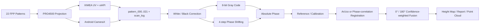

# 구조광을 이용한 PCB 3D 스캐닝 프로젝트

> PRO4500/LightCrafter 4500 패턴 투사, XIMEA UV 또는 Android 카메라 동기 촬영, Gray code + 4-step phase shifting 복원을 하나의 계측 파이프라인으로 연결한 프로젝트

**현재 상태: 진행 중 / 캡처·디코딩 소프트웨어 구현 단계**

## 프로젝트 구성

| 단계 | 저장소 | 책임 |
| --- | --- | --- |
| UV 카메라 캡처 | `PRO4500_Control_System-UV` | PRO4500 패턴 투사, XIMEA xiAPI 촬영, 다중 노출 HDR, 메타데이터 |
| 모바일 캡처 | `PRO4500_Android_CONTROL` | PC 마스터, Android CameraX 촬영, WebSocket/HTTP 동기화, 0°/180° 진행 |
| 3D 복원 | `PCBSCAN_calc_height` | Gray code/PSP 위상 복원, 기준면·캘리브레이션, 정합·융합, GUI/EXE |

앞의 두 저장소는 서로 다른 카메라 경로이며, 둘 다 디코더가 읽는 `pattern_000.png`…`pattern_021.png` 계약을 사용합니다.

## End-to-end pipeline



## 1. PRO4500 + XIMEA UV 캡처

- USB HID로 LightCrafter 4500 Blue LED 밝기를 제어하고 이미지 폴더의 패턴을 투사합니다.
- `CameraInterface`/`CameraProvider`로 XIMEA와 Mock camera를 교체할 수 있습니다.
- PC가 패턴 표시 → 안정화 대기 → xiAPI software trigger → `xiGetImage` 저장 순서를 관리합니다.
- XIMEA hardware edge trigger와 freerun preview 경로도 구분합니다.
- short/mid/long 다중 노출 원본, HDR 병합 이미지, 포화·암부 mask를 함께 저장합니다.
- rig ID, calibration ID, 프로젝터 기울기, 초점·Scheimpflug 확인 여부를 로그에 남깁니다.

## 2. PRO4500 + Android 캡처

- Win32 GUI가 Python PC controller를 백그라운드에서 실행하고 PRO4500·휴대폰·출력 폴더를 한 화면에서 제어합니다.
- PC는 FastAPI WebSocket/HTTP 서버로 동작하며 항상 스캔의 master가 됩니다.
- Android CameraX 앱은 `capture` 명령을 받은 뒤 PNG를 업로드하고 `capture_done`을 보냅니다.
- PC는 같은 `scan_id`, `pattern_id`, `capture_id`의 업로드와 ACK를 모두 받아야 다음 패턴으로 진행합니다.
- 노출·ISO·초점 고정과 `0,180` 멀티 각도 촬영을 지원합니다.

## 3. Gray code + 4-step PSP 디코더

```text
White / Black correction
→ Gray-code stripe index k
→ wrapped phase φ from I0, I90, I180, I270
→ absolute phase Φ = 2πk + φ
→ reference subtraction or calibrated height conversion
```

- 기본 14패턴과 반전 Gray를 포함한 22패턴 입력을 모두 처리합니다.
- 신호 세기, 포화, 암부, modulation, Gray pair contrast mask를 분리해 진단합니다.
- `relative`, `reference`, `triangulation`, `inverse-linear` 높이 모드를 구분합니다.
- ArUco homography 또는 phase correlation으로 0°/180° 촬영을 정렬합니다.
- 양쪽이 유효한 픽셀은 sine modulation 신뢰도로 가중 융합합니다.
- 결과를 NumPy 배열, heat map, JSON 보고서, 선택적 PLY point cloud로 저장합니다.
- GUI와 PyInstaller 기반 Windows 실행 파일 경로를 제공합니다.

## 개발 현황

- Android 경로는 PNG 저장·업로드까지 구현되어 있고 RAW/DNG와 하드웨어 트리거 동기화는 아직 포함되지 않았습니다.
- `relative` 모드는 기준면 없이 phase 기반 형상 미리보기를 생성하고, 물리 단위 높이는 기준면과 실장비 캘리브레이션을 사용하는 `triangulation` 또는 `inverse-linear` 모드에서 계산합니다.
- 디코더는 프로젝터 기울기, 초점, PCB 반사·포화 상태를 확인할 수 있도록 valid mask와 진단 이미지를 height map과 함께 출력합니다.

## 기술 스택

`C++/Win32` · `Python` · `NumPy` · `OpenCV` · `Tkinter` · `xiAPI` · `USB HID` · `FastAPI` · `WebSocket` · `Kotlin/CameraX`

## 코드와 문서

- [XIMEA UV 캡처 시스템](https://github.com/eriverOoO/PRO4500_Control_System-UV)
- [카메라 추상화](https://github.com/eriverOoO/PRO4500_Control_System-UV/blob/main/camera_provider.py)
- [Android 캡처 시스템](https://github.com/eriverOoO/PRO4500_Android_CONTROL)
- [PC–Android 프로토콜](https://github.com/eriverOoO/PRO4500_Android_CONTROL/blob/main/protocol.md)
- [PCB FPP 디코더](https://github.com/eriverOoO/PCBSCAN_calc_height)
- [높이 계산 이론](https://github.com/eriverOoO/PCBSCAN_calc_height/blob/main/HEIGHT_CALCULATION_THEORY.md)
- [디코더 핵심 구현](https://github.com/eriverOoO/PCBSCAN_calc_height/blob/main/pcb_fpp_decoder/decoder.py)
