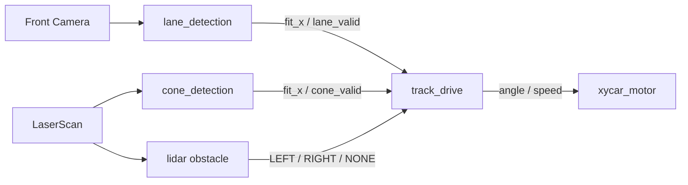

# 국민대 자율주행경진대회

> 카메라 차선, LiDAR 라바콘·장애물 정보를 결합하고 주행 상황에 따라 인지·제어 모드를 전환하는 ROS 2 자율주행 시스템

## 시스템 구조

## 구현 포인트

### 카메라 차선 인식

- 전방 카메라 영상을 OpenCV로 처리해 주행 중심선 `fit_x`를 생성합니다.
- 검출 결과와 별도로 `/vision/lane_valid`를 발행해 perception loss를 제어기가 알 수 있게 합니다.
- 라바콘 모드 활성 여부를 받아 차선 처리와의 충돌을 줄입니다.

### LiDAR 라바콘·장애물 인식

- 라바콘 포인트에서 가상 주행 중심선을 만들고 차선 노드와 동일한 `fit_x` 형식으로 발행합니다.
- 일반 장애물은 `LEFT`, `RIGHT`, `NONE`으로 정규화해 회피 offset으로 변환합니다.
- 차선 유효성에 따라 라바콘 모드 사용 여부를 판단합니다.

### 상태 기반 주행 제어

| 상태 | 제어 의도 |
| --- | --- |
| `CONE_DRIVING` | 라바콘 가상 경로 추종, 일반 장애물 offset 차단 |
| `STRAIGHT` | 긴 look-ahead와 높은 목표 속도 |
| `SOFT_CURVE` | 곡률에 맞춘 중간 속도·조향 gain |
| `SHARP_CURVE` | 짧은 look-ahead와 보수적인 속도 |
| `EMERGENCY` | 차선·라바콘 경로가 모두 유효하지 않을 때 정지 |

- `fit_x`의 2차 다항식 곡률로 직선·완만한 곡선·급곡선을 구분합니다.
- 상태마다 look-ahead, steering gain, 속도를 다르게 적용합니다.
- 장애물 방향에 따라 목표 경로를 좌우로 이동하지만 라바콘 구간에서는 이 규칙을 비활성화합니다.
- perception 입력이 사라졌을 때 이전 명령을 계속 유지하지 않고 emergency fallback으로 전환합니다.

## 설계에서 드러나는 강점

차선과 라바콘 인식은 센서와 알고리즘이 다르지만 같은 `fit_x + valid` 인터페이스를 제공합니다. 따라서 주행 노드는 경로 생성 방식이 아니라 현재 신뢰할 수 있는 경로와 주행 상태에 집중할 수 있습니다. 장애물 회피와 라바콘 추종 규칙이 동시에 작동하지 않도록 우선순위도 명시했습니다.

## 기술 스택

`ROS 2` · `Python` · `OpenCV` · `NumPy` · `sensor_msgs/LaserScan` · `xycar_msgs`

## 코드 근거

- [통합 주행 제어](https://github.com/eriverOoO/skkrrr/blob/main/track_drive/track_drive.py)
- [카메라 차선 인식](https://github.com/eriverOoO/skkrrr/blob/main/track_drive/lane_detection.py)
- [라바콘 경로 생성](https://github.com/eriverOoO/skkrrr/blob/main/track_drive/cone_detection.py)
- [LiDAR 장애물 처리](https://github.com/eriverOoO/skkrrr/blob/main/track_drive/lidar.py)
