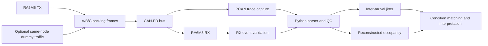

# CAN-FD Signal Packing and Receive-Timing Study

[한국어](README.md) | [English](README.en.md)

> A joint research project comparing how different frame organizations for the same mixed-period payload affect **receive-frame inter-arrival jitter** and model-based bus-occupancy estimates. My contribution covered **analysis workflow design, condition review, error discovery, measurement normalization, remeasurement, and interpretation**.

| Item | Details |
|---|---|
| Research topic | CAN-FD signal-packing strategies A/B/C |
| Setup | RA6M5 TX/RX, CAN-FD, PCAN traces, Python analysis |
| Primary metric | RX inter-arrival jitter |
| My role | Data QC, condition matching, error tracking, remeasurement, interpretation, report writing |
| Disclosure | Purpose, method, and limitations only; source data and numerical results remain private pending approval |

## 1. Project Overview

In a vehicle network, timing behavior can be influenced not only by signal periods but also by how signals are grouped into CAN-FD frames. This study constructed three strategies for the same 64-byte mixed-period payload: multiple small frames, one frame per period group, and a single combined frame. RA6M5 transmit/receive nodes and PCAN traces were used for comparison.

The goal was not to generalize that one strategy is always superior. It was to **measure timing differences observed under matched experimental conditions and define the limits of their interpretation**.

## 2. Period and Result

- Repeated measurement and run-level quality checks were completed.
- Actual IDs, DLCs, payloads, timestamps, and bitrate conditions were cross-checked instead of trusting filenames or the test plan alone.
- Results with unmatched conditions or failed claim gates were retained as limitations rather than deleted or interpreted favorably.
- Detailed values, plots, and tables are not included because external publication approval for the joint research is pending.

## 3. Development Environment

| Area | Technology |
|---|---|
| TX/RX | Renesas RA6M5-based CAN-FD nodes |
| Capture | PCAN trace capture |
| Analysis | Python parsing, quality control, statistics, and visualization |
| Input checks | CAN ID, DLC, payload, timestamp, nominal/data bitrate |
| Output | Run-level metrics, condition tables, validation plots |

## 4. System Architecture



### Packing strategies

| Strategy | Frame organization | Comparison purpose |
|---|---|---|
| A | Distributes the 5 ms and 50 ms signal groups across multiple small frames | Distributed-transmission baseline |
| B | Combines each period group's payload into one frame | Period-group packing comparison |
| C | Combines the entire mixed-period payload into one 64-byte frame | Maximum-packing comparison |

Repeated payloads were configured to be byte-identical across strategies, limiting payload-dependent and bit-stuffing variation where possible.

## 5. My Contribution

### Analysis and quality control

- Organized the workflow from trace parsing through run-level metrics, condition comparison, and plot generation
- Built QC around actual frame contents and configuration rather than filenames
- Checked missing or duplicate frames, invalid DLC, and condition mismatch before interpretation

### Error discovery and remeasurement

- Separated cases where the experimental plan and actual trace conditions differed
- Used strict/near/unmatched gates to prevent inappropriate direct comparisons
- Normalized conditions, repeated measurements, and preserved failed claim gates in the result record

### Interpretation and reporting

- Separated measured metrics from unmeasured quantities to avoid overstated conclusions
- Interpreted strategy differences only within the experimental setup and documented limits on generalization
- Wrote the final research report and reviewed the analysis results

### Evidence and contribution boundary

The report authorship and analysis/validation records support the role above. However, the available Git history begins with a publication-candidate packaging stage; it does not prove original authorship of all firmware or analysis source. I therefore do not present the joint research source or results as my sole work.

## 6. Problems and Solutions

| Problem | Approach | Why it matters |
|---|---|---|
| Filenames could differ from actual test conditions | Validated IDs, DLCs, payloads, timestamps, and bitrates directly | Prevented misclassified runs from entering the statistics |
| Load conditions were not always exactly matched | Applied strict/near/unmatched gates using reconstructed occupancy | Separated comparable conditions from reference-only conditions |
| A full-ordering assumption failed at a high-load condition | Preserved the failed claim gate as a limitation | Prioritized falsifiability over a favorable result |
| Trace and separate instrumentation campaigns covered different scopes | Kept data sources and campaigns separate in the interpretation | Avoided causal claims across different measurements |
| The transmitting node also generated dummy-load frames | Documented the same-node dummy-traffic limitation | Did not claim complete isolation of external-node contention |

## 7. Validation and Current Result

- Performed format and condition QC across repeated traces.
- Normalized conditions and repeated measurements to identify the comparable data scope.
- Recorded both statistical outcomes and the pass/fail state of comparison and claim gates.
- Detailed numerical results and representative plots remain private pending publication approval.

### Measurement boundaries that must remain explicit

1. The primary measurement is **RX inter-arrival jitter**, not transmit-to-receive one-way latency.
2. **Reconstructed occupancy** is calculated from frame length and bitrate assumptions; it is not actual PCAN-measured bus load.
3. Dummy traffic originates from the same TX node, so the setup does not isolate pure external-node contention.
4. The study does not validate motor stability, PID oscillation, or physical PWM edges.

## 8. Repository Contents

```text
.
├─ README.md      # Korean portfolio
└─ README.en.md   # English portfolio
```

Real TRC files, firmware, FSP-generated code, analysis source, numerical tables/plots, and internal reports are not included.

## 9. Limitations

- Differences observed in the laboratory setup cannot be directly generalized to an entire production vehicle network.
- RX inter-arrival jitter alone does not establish end-to-end control latency.
- Calculated occupancy is not a measured bus-load value from the instrument.
- Further work requires external multi-node contention and closed-loop validation through a real actuator.
- Detailed results remain withheld until publication rights for the joint work are confirmed.

## 10. Attribution

This was a team and laboratory research activity. The original private repository, full RA6M5 firmware, FSP-generated artifacts, TRC files, laboratory documents, and teammate source were neither modified nor disclosed. This README describes only my verified analysis, validation, and reporting scope and does not claim sole ownership of the joint source or results.
