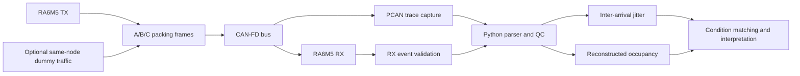

# CAN-FD 신호 패킹과 수신 타이밍 연구

[한국어](README.md) | [English](README.en.md)

> 동일한 mixed-period payload를 서로 다른 프레임 구성으로 전송했을 때 **수신 프레임의 inter-arrival jitter**와 모델 기반 버스 점유율 추정치가 어떻게 달라지는지 비교한 공동 연구입니다. 저는 **분석 과정 구성, 측정 조건 검토, 오류 발견과 조건 통일, 재측정 및 결과 해석**에 참여했습니다.

| 항목 | 내용 |
|---|---|
| 연구 대상 | CAN-FD signal packing 전략 A/B/C |
| 실험 구성 | RA6M5 TX/RX, CAN-FD, PCAN trace, Python 분석 |
| 핵심 지표 | RX inter-arrival jitter |
| 역할 | 데이터 QC, 조건 비교, 오류 추적, 재측정, 해석 및 보고서 작성 |
| 공개 상태 | 연구 목적·방법·한계만 공개; 원본과 수치 결과는 승인 전 비공개 |

## 1. 프로젝트 개요

차량 네트워크에서는 신호의 생성 주기뿐 아니라 여러 신호를 어떤 CAN-FD 프레임으로 묶는지가 프레임 도착 간격과 전송 점유 형태에 영향을 줄 수 있습니다. 이 연구에서는 동일한 64 B mixed-period payload를 여러 소형 프레임으로 나누거나 주기별·전체 payload 단위로 합치는 A/B/C 전략을 구성하고, RA6M5 송수신 노드와 PCAN trace를 이용해 비교했습니다.

목표는 특정 전략이 항상 우수하다고 일반화하는 것이 아니라, **동일 조건에서 패킹 방식에 따라 관측되는 타이밍 차이를 측정하고 그 해석 범위를 명확히 하는 것**입니다.

## 2. 기간 및 결과

- 반복 측정과 run-level 품질 검사를 수행했습니다.
- 파일명이나 계획표만 신뢰하지 않고 실제 ID, DLC, payload, timestamp와 bitrate 조건을 교차 확인했습니다.
- 비교 조건이 맞지 않거나 claim gate를 통과하지 못한 결과는 삭제하거나 유리하게 해석하지 않고 제한사항으로 보존했습니다.
- 전체 수치, 그래프와 표는 공동 연구의 공개 승인 전이므로 이 저장소에 싣지 않았습니다.

## 3. 개발 환경

| 구분 | 사용 항목 |
|---|---|
| TX/RX | Renesas RA6M5 기반 CAN-FD 송수신 노드 |
| Capture | PCAN trace |
| Analysis | Python 기반 parsing, QC, 통계 및 시각화 |
| Input checks | CAN ID, DLC, payload, timestamp, nominal/data bitrate |
| Output | run-level metrics, 조건별 비교표, 검증 그래프 |

## 4. 시스템 구조



### 패킹 전략

| 전략 | 프레임 구성 개념 | 비교 목적 |
|---|---|---|
| A | 5 ms와 50 ms 신호 그룹을 각각 여러 소형 프레임으로 분산 | 분산 전송 기준 조건 |
| B | 각 주기 그룹의 payload를 하나의 프레임으로 통합 | 주기 그룹별 패킹 효과 비교 |
| C | 전체 mixed-period payload를 하나의 64 B 프레임으로 통합 | 최대 패킹 조건 비교 |

세 전략은 반복 payload를 byte-identical하게 구성해 payload 차이와 bit-stuffing 변수를 가능한 범위에서 통제했습니다.

## 5. My Contribution

### 분석과 품질 검사

- trace parsing부터 run-level 지표, 조건 비교와 그래프 생성까지의 분석 흐름 정리
- 파일명 대신 실제 프레임 내용과 설정을 검사하도록 QC 조건 구성
- 누락·중복·잘못된 DLC와 조건 불일치를 결과 해석 전에 확인

### 오류 발견과 재측정

- 실험 계획과 실제 trace 조건이 다른 사례를 분리
- strict/near/unmatched 조건으로 비교 가능성을 나눠 부적절한 직접 비교 방지
- 조건을 통일한 뒤 재측정하고, 통과하지 못한 claim gate도 결과 기록에 유지

### 결과 해석과 보고

- 측정 지표와 측정하지 않은 지표를 분리해 과도한 결론 방지
- 패킹 전략별 차이를 실험 구성 안에서 해석하고 외부 환경으로의 일반화 한계 정리
- 최종 연구 보고서 작성 및 분석 결과 검토

### 기여 근거와 경계

최종 보고서의 작성자와 분석·검증 기록으로 위 역할을 확인했습니다. 다만 현재 Git history는 공개 후보 패키징 시점부터 시작하므로 전체 firmware나 분석 source의 최초 저작자를 증명하지 않습니다. 따라서 공동 연구 코드와 결과물을 제 단독 작성물로 표현하지 않습니다.

## 6. 주요 문제와 해결

| 문제 | 해결 접근 | 의미 |
|---|---|---|
| 파일명과 실제 실험 조건이 일치하지 않을 수 있음 | 프레임 ID, DLC, payload, timestamp, bitrate를 직접 검증 | 잘못 분류된 run이 통계에 포함되는 것을 방지 |
| 조건별 부하가 완전히 일치하지 않음 | reconstructed occupancy를 이용해 strict/near/unmatched gate 적용 | 비교 가능한 조건과 참고용 조건을 분리 |
| 높은 부하 조건에서 전체 순서 가정이 성립하지 않음 | 실패한 claim gate를 숨기지 않고 제한사항으로 기록 | 결과보다 검증 가능성을 우선 |
| trace 결과와 별도 계측 캠페인의 범위가 다름 | 데이터 출처와 실험 캠페인을 구분해 해석 | 서로 다른 측정으로 인과관계를 과장하지 않음 |
| 동일 TX 노드가 부하 프레임도 생성함 | same-node dummy traffic 한계를 명시 | 외부 노드 경합을 완전히 재현한 실험으로 주장하지 않음 |

## 7. 검증 및 현재 결과

- 반복 trace에 대해 형식과 조건 QC를 수행했습니다.
- 조건 통일 및 재측정을 통해 비교 가능한 데이터 범위를 정리했습니다.
- 통계 결과뿐 아니라 비교 조건과 claim gate의 통과 여부를 함께 기록했습니다.
- 공개 승인 전이므로 세부 수치와 대표 그래프는 공개하지 않습니다.

### 반드시 구분해야 하는 측정 범위

1. 측정값은 **RX inter-arrival jitter**이며 송신부터 수신까지의 one-way latency가 아닙니다.
2. **Reconstructed occupancy**는 frame length와 bitrate 가정을 이용한 계산값이며 PCAN이 직접 측정한 실제 bus load가 아닙니다.
3. Dummy traffic은 동일한 TX 노드에서 생성되어 외부 노드 간 contention만을 분리하지 못합니다.
4. 본 연구는 motor stability, PID 진동 또는 실제 PWM edge를 검증하지 않았습니다.

## 8. 파일 구성

```text
.
├─ README.md      # 한국어 포트폴리오
└─ README.en.md   # English portfolio
```

실제 TRC, firmware, FSP 생성 코드, 분석 source, 수치 표·그래프와 내부 보고서는 포함하지 않습니다.

## 9. 한계

- 실험실 구성에서 관측된 차이를 실제 차량 네트워크 전체에 그대로 일반화할 수 없습니다.
- RX inter-arrival jitter만으로 end-to-end 제어 지연을 설명할 수 없습니다.
- 계산된 점유율은 실제 계측기의 bus-load 측정값이 아닙니다.
- 외부 다중 노드 경합과 실제 구동기까지 연결된 폐루프 검증이 필요합니다.
- 공동 연구 결과의 외부 공개 권한이 확정되지 않아 상세 결과를 보류했습니다.

## 10. Attribution

본 연구는 팀·연구실 공동 활동입니다. 원본 비공개 저장소, 전체 RA6M5 firmware, FSP 생성물, TRC, 연구실 문서와 팀원 코드는 수정하거나 공개하지 않았습니다. 이 README는 확인된 제 분석·검증·보고 범위와 연구 방법만 설명하며, 공동 결과나 source의 단독 소유권을 주장하지 않습니다.
