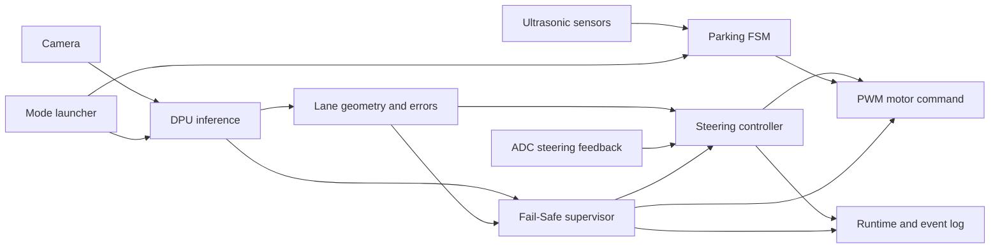
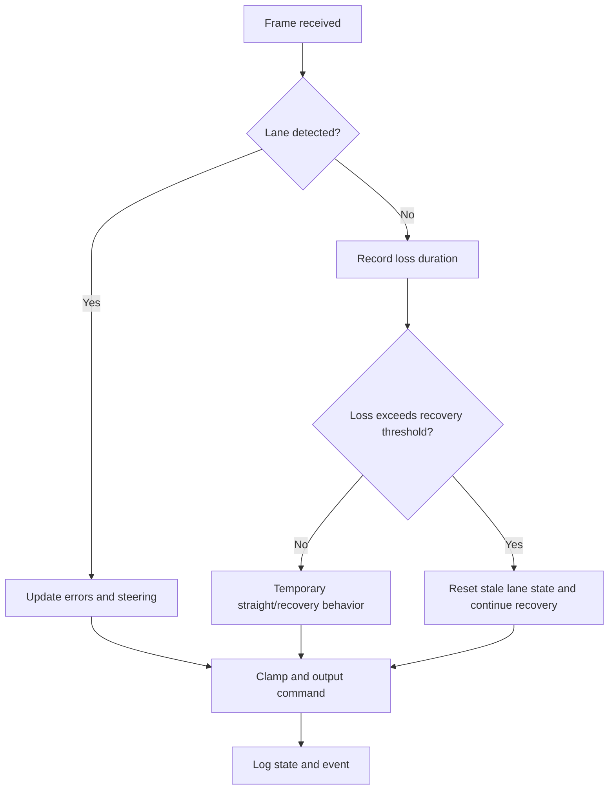

# Autonomous Driving AI Chip Design Competition — In Progress

[한국어](README.md) | [English](README.en.md)

> A team project integrating PYNQ DPU inference with PWM vehicle control, driving and parking modes, and fail-safe behavior. My role focuses on **steering and driving-control integration, ADC feedback, lane-loss recovery tuning, and vehicle-level debugging and validation**.

| Item | Details |
|---|---|
| Period | 2026 — in progress |
| Status | Integration and repeated testing; final result not yet determined |
| My role | Steering and driving control, sensor feedback, parameter tuning, system debugging |
| Stack | Python, PYNQ, Vitis AI/DPU, OpenCV, MMIO, PWM, ADC, ultrasonic sensors |
| Disclosure | Architecture and validation process only; team source, models, and FPGA artifacts remain private |

## 1. Project Overview

This small-scale autonomous-driving system estimates lane geometry from camera input and DPU-assisted perception, then converts steering error into PWM vehicle commands. Driving and ultrasonic-based parking modes are launched from one runtime, with explicit handling for resource initialization, recovery behavior, and event logging.

My role is not presented as sole authorship of a new perception algorithm. It is primarily **system integration: connecting team perception and control components on the PYNQ vehicle, tuning steering response and recovery conditions, and validating the resulting behavior**.

## 2. Period and Result

- Period: 2026, currently in progress
- Current state: repeated integration testing of DPU inference, driving control, sensor input, and mode selection
- Final award and official performance: not yet available
- Internal timing observations are omitted because they are not official, controlled results
- Parking logs include aborted tests, so no parking-completion claim is made

## 3. Development Environment

| Area | Technology |
|---|---|
| Compute | PYNQ FPGA board, Vitis AI DPU |
| Perception | Camera, DPU inference, OpenCV-based lane processing |
| Control | Stanley-family steering, PWM motor control, ADC steering feedback |
| Parking | Ultrasonic sensing, parking FSM |
| Interface | MMIO, overlay and resource loading |
| Validation | Runtime/event logging, calibration display, repeated vehicle tests |

## 4. System Architecture



### Lane-loss fail-safe



The current integrated runtime distinguishes transient lane loss from prolonged loss. It uses an approximately three-second recovery threshold so stale lane state does not continue to influence steering indefinitely.

## 5. My Contribution

### Steering and driving-control integration

- Connected lane-error and steering-control output to the PWM command flow
- Used ADC steering feedback to compare commanded and physical steering state
- Reviewed and tuned steering range and abrupt-change limits against vehicle response

### Parameter tuning and fail-safe validation

- Tuned `max_jump`, the limit used to reject abrupt frame-to-frame lane-position changes
- Validated temporary straight/recovery behavior and state reset after prolonged lane loss
- Repeatedly checked steering centering and initial commands after mode changes

### System integration and debugging

- Reviewed runtime behavior so driving and parking overlays/resources load only when needed
- Isolated DPU, MMIO, camera, and sensor initialization failures by component
- Used runtime/event logging and calibration views to validate frame processing, steering state, and recovery events

### Contribution boundary and evidence

| Evidence | Verified scope |
|---|---|
| Team role sheet and development report | Steering/driving control, Stanley tuning, ADC feedback, `max_jump`, and lane-loss recovery tuning |
| Integration manifest | Separates the retained CYH runtime from ported PJH driving logic |
| Commit `35ee137` | Manual-steering clamp correction and cache cleanup |

The integration manifest identifies lane fitting, heading error, dynamic offset, CTE, and the core Stanley logic as ported from a PJH teammate's driving implementation. I therefore do not claim those algorithms as my sole implementation.

## 6. Problems and Solutions

| Problem | Approach | Validation |
|---|---|---|
| Stale steering state could persist during a temporary lane loss | Tracked loss duration and separated temporary recovery from state reset | Replayed lane-loss sections and inspected event logs |
| Frame-to-frame lane jumps caused steering oscillation | Tuned `max_jump` and steering-change limits | Repeated the same route and compared ADC feedback |
| DPU, camera, and overlay initialization conflicted across modes | Delayed mode-specific resource loading | Restarted driving and parking modes independently |
| Commanded steering differed from physical steering position | Used ADC feedback and a center-alignment procedure | Calibrated at rest and checked response during driving |
| Failures could originate in perception, control, or hardware | Recorded stage-specific runtime and event states | Correlated sensor state and events around each fault |

## 7. Validation and Current Result

- Integrated the data path from camera input and DPU execution to steering calculation and PWM output on PYNQ.
- Repeatedly tested lane-loss recovery, steering limits, and center alignment.
- Continued checking resource-loading and initialization conflicts between driving and parking modes.
- Because the project is ongoing, no award, final course time, or parking success rate is claimed.

## 8. Repository Contents

```text
.
├─ README.md      # Korean portfolio
└─ README.en.md   # English portfolio
```

No Python source, models, FPGA artifacts, datasets, logs, or internal reports are included in this public folder.

## 9. Limitations

- Final competition results and official performance are not yet available.
- Internal tests are not a fully controlled benchmark.
- Parking integration is still under test; no completion-performance claim is made.
- The implementation includes teammate and educational baseline code, so this README explicitly separates individual contribution from team functionality.

## 10. Attribution

This is a team project. Part of the perception and core Stanley control was ported from a PJH teammate's implementation, while the runtime, mode execution, parking, and calibration flow contains existing CYH team code. I claim only the verified integration, feedback, parameter-tuning, and debugging scope described above. `bit`, `hwh`, `xclbin`, `xmodel`, datasets, teammate source, and educational baselines remain private for security and ownership reasons.
