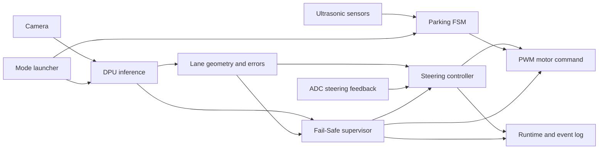
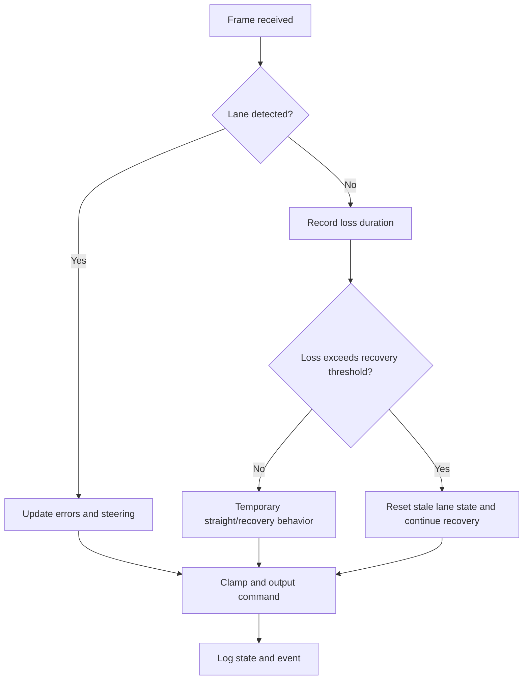

# 교내 자율주행 AI Chip 설계대회 — 진행 중

[한국어](README.md) | [English](README.en.md)

> PYNQ 보드의 DPU 추론 결과를 PWM 차량 제어와 연결하고, 주행·주차 모드 및 Fail-Safe를 하나의 실행 흐름으로 통합하는 팀 프로젝트입니다. 저는 **조향·주행 제어 통합, ADC 피드백, 차선 미검출 복귀 파라미터 튜닝, 실차 디버깅과 검증**을 담당하고 있습니다.

| 항목 | 내용 |
|---|---|
| 기간 | 2026 — 진행 중 |
| 상태 | 통합 및 반복 시험 단계, 최종 결과 미확정 |
| 역할 | 조향·주행 제어, 센서 피드백, 파라미터 튜닝, 시스템 디버깅 |
| 기술 | Python, PYNQ, Vitis AI/DPU, OpenCV, MMIO, PWM, ADC, 초음파 센서 |
| 공개 범위 | 시스템 설계와 검증 과정만 공개; 팀 소스·모델·FPGA 산출물 비공개 |

## 1. 프로젝트 개요

카메라 입력과 DPU 기반 인식 결과를 이용해 차선을 추정하고, 조향 오차를 차량의 PWM 명령으로 변환하는 소형 자율주행 시스템입니다. 주행 모드와 초음파 기반 주차 모드를 하나의 런처에서 선택할 수 있도록 구성하고, 장치 초기화 순서와 오류 복구, 이벤트 기록을 함께 다루고 있습니다.

제 역할은 새로운 인식 알고리즘을 단독 개발하는 것이 아니라, **팀의 인식·제어 구성 요소가 실제 PYNQ 차량에서 일관되게 동작하도록 연결하고 조향 응답과 복구 조건을 조정하는 시스템 통합**에 가깝습니다.

## 2. 기간 및 결과

- 기간: 2026년, 현재 진행 중
- 현재 상태: DPU 추론, 주행 제어, 센서 입력 및 모드 선택을 통합해 반복 시험 중
- 최종 수상 및 공식 성능: 아직 확정되지 않음
- 내부 시험 시간과 비공식 성능 수치는 최종 결과로 오해될 수 있어 공개하지 않음
- 주차 로그에는 중단된 시험이 포함되어 있어 주차 성공을 결과로 주장하지 않음

## 3. 개발 환경

| 구분 | 사용 항목 |
|---|---|
| Compute | PYNQ FPGA board, Vitis AI DPU |
| Perception | Camera, DPU inference, OpenCV-based lane processing |
| Control | Stanley 계열 조향, PWM motor control, ADC steering feedback |
| Parking | Ultrasonic sensing, parking FSM |
| Interface | MMIO, overlay/resource loading |
| Validation | Runtime/event logging, calibration display, repeated vehicle tests |

## 4. 시스템 구조



### 차선 미검출 Fail-Safe



현재 통합본은 일시적인 차선 미검출과 장시간 미검출을 구분하고, 약 3초의 복귀 기준을 사용해 오래된 차선 상태가 조향에 계속 반영되지 않도록 구성했습니다.

## 5. My Contribution

### 조향·주행 제어 통합

- 차선 오차와 조향 제어 결과를 PWM 차량 명령 흐름에 연결
- ADC 조향 피드백을 이용해 명령과 실제 조향 상태를 함께 점검
- 조향 명령의 범위와 급격한 변화 제한 조건을 실차 반응에 맞게 검토·조정

### 파라미터 튜닝과 Fail-Safe 검증

- 프레임 간 차선 위치 변화 제한값인 `max_jump` 튜닝
- 차선 미검출 시 임시 직진과 장시간 미검출 상태 초기화 흐름 검증
- 조향 중앙 정렬과 모드 전환 후 초기 명령을 반복 점검

### 시스템 통합과 디버깅

- 주행·주차 모드에서 필요한 overlay와 자원을 실행 시점에 맞춰 로드하도록 통합 흐름 점검
- DPU, MMIO, 카메라, 센서 초기화 실패를 구성 요소별로 분리해 확인
- 런타임·이벤트 로그와 보정 화면을 활용해 프레임 처리, 조향 상태, 복구 이벤트 검증

### 기여 경계와 근거

| 근거 | 확인 내용 |
|---|---|
| 팀 역할표·개발 보고서 | 조향·주행 제어, Stanley 튜닝, ADC 피드백, `max_jump`·미검출 복귀 튜닝 담당 |
| 통합 manifest | 기존 CYH runtime과 PJH 주행 로직의 출처 및 이식 범위를 구분 |
| Commit `35ee137` | 수동 조향 clamp 수정과 캐시 정리 확인 |

통합 manifest에 따르면 차선 fitting, heading error, dynamic offset, CTE와 Stanley 핵심 로직은 PJH 팀원의 주행 코드에서 이식되었습니다. 따라서 해당 알고리즘을 제 단독 구현으로 표현하지 않습니다.

## 6. 주요 문제와 해결

| 문제 | 접근 | 검증 방법 |
|---|---|---|
| 차선이 잠시 사라질 때 오래된 조향 상태가 남을 수 있음 | 미검출 지속 시간을 추적하고 임시 복구와 상태 초기화를 구분 | 차선 미검출 구간을 반복 입력하고 이벤트 로그 확인 |
| 프레임별 차선 위치가 급변하면 조향이 흔들림 | `max_jump`와 조향 변화 제한 조건 조정 | 동일 구간 반복 주행 및 ADC 피드백 비교 |
| DPU·카메라·overlay 초기화 순서가 모드 간 충돌 | 모드별 자원을 필요한 시점에 지연 로드 | 주행/주차 모드를 독립적으로 재시작해 확인 |
| 명령 조향과 실제 기구 조향 사이에 편차 존재 | ADC 피드백과 중앙 정렬 절차 사용 | 정지 상태 보정 후 실제 주행 응답 확인 |
| 오류 원인이 인식·제어·장치 중 어디인지 불명확 | runtime/event logging으로 단계별 상태 기록 | 오류 시점 전후의 이벤트와 센서 상태 대조 |

## 7. 검증 및 현재 결과

- PYNQ 환경에서 카메라 입력, DPU 실행, 조향 계산, PWM 출력까지의 데이터 흐름을 통합했습니다.
- 차선 미검출 복귀, 조향 제한, 중앙 정렬을 반복 시험하고 있습니다.
- 주행과 주차 모드의 자원 로딩 및 초기화 충돌을 점검하고 있습니다.
- 프로젝트가 진행 중이므로 수상, 최종 주행 시간, 주차 성공률을 아직 결과로 제시하지 않습니다.

## 8. 파일 구성

```text
.
├─ README.md      # 한국어 포트폴리오
└─ README.en.md   # English portfolio
```

이 공개 폴더에는 Python source, 모델, FPGA 산출물, dataset, 로그와 내부 보고서를 포함하지 않습니다.

## 9. 한계

- 최종 대회 결과와 공식 성능이 확정되지 않았습니다.
- 내부 시험은 환경과 조건이 완전히 통제된 benchmark가 아닙니다.
- 주차 기능은 통합 시험 중이며 완료 성능을 주장하지 않습니다.
- 실제 구현에는 팀원 코드와 교육용 기반 코드가 포함되어 있어 공개 README에서 개인 기여를 분리했습니다.

## 10. Attribution

이 프로젝트는 팀 공동 개발입니다. 인식과 Stanley 제어의 핵심 일부는 PJH 팀원의 코드에서 이식되었고, runtime·모드 실행·주차 및 보정 흐름에는 기존 CYH 팀 코드가 포함됩니다. 저는 확인된 조향·주행 제어 통합, 피드백, 파라미터 튜닝과 디버깅 범위만 제 기여로 기술했습니다. `bit`, `hwh`, `xclbin`, `xmodel`, dataset, 팀원 source와 교육용 baseline은 권리 및 보안 문제로 공개하지 않습니다.
