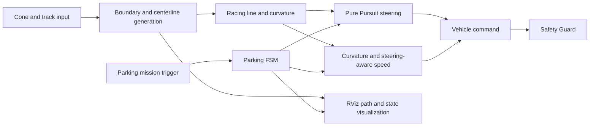

# Campus Autonomous Driving Hackathon — 2nd Place

[한국어](README.md) | [English](README.en.md)

> A four-person ROS-based autonomous-driving simulation project integrating path tracking, parking state machines, safety logic, and a high-speed driving strategy. My role focused on **driving and parking control integration, parameter tuning, fail-safe behavior, and debugging tools**.

| Item | Details |
|---|---|
| Period | Nov 21, 2025, 17:00 — Nov 22, 2025, 10:00 |
| Result | 2nd place; completed two of three parking missions |
| Team | 4 members |
| My role | Control integration, parking FSM, path-following and speed tuning, validation |
| Stack | Python, ROS Noetic, Pure Pursuit, FSM, RViz, autonomous-driving simulator |

## 1. Project Overview

The team built an autonomous-driving system that generated a drivable path from cone and track information, calculated steering with Pure Pursuit, and adjusted speed according to driving conditions. Normal driving and parking missions were integrated into a single control flow. State and path visualizations enabled rapid testing and parameter adjustment within the short competition schedule.

Our competition strategy prioritized **reliably completing the parking missions we could validate while maintaining a fast pace on the main course**. The vehicle completed two of the three parking missions and the team finished in second place.

## 2. Period and Result

- Event: Nov 21, 2025, 17:00 — Nov 22, 2025, 10:00
- Final result: 2nd place
- Parking result: two of three missions completed
- Evidence: verified from the team award certificate

The number of participating teams was not independently verified from an official source, so it is intentionally omitted. No reproducible lap-time dataset or quantitative improvement rate was available; this README therefore does not invent performance figures.

## 3. Development Environment

| Area | Technology |
|---|---|
| Runtime | ROS Noetic, Python |
| Control | Pure Pursuit, steering-aware speed control, finite-state machines |
| Planning | Cone-boundary centerline and racing-line generation, curvature-aware speed planning |
| Validation | RViz markers, state logs, repeated simulation runs |

## 4. System Architecture



## 5. My Contribution

### Parking control integration

- Structured front-parking and parallel-parking maneuvers as explicit state machines
- Connected approach, entry, alignment, and stop stages to transition conditions and vehicle commands
- Integrated normal driving and parking modes without competing command paths

### Path tracking and speed strategy

- Connected Pure Pursuit steering to the generated driving line
- Tuned speed behavior according to curvature and steering demand
- Balanced straight-line speed against stability in high-steering sections

### Fail-safe and validation tooling

- Applied a Safety Guard so unsafe commands would not persist during abnormal states
- Visualized the centerline, racing line, target point, steering direction, and FSM state in RViz
- Added debug information that helped separate path-generation issues from control issues during tuning

### Evidence of contribution

| Commit | Verified file and scope |
|---|---|
| `a5c79ac` | Parking logic and state-machine integration in `brain_final.py` |
| `c2c9fb7` | Racing-line optimization and debugging integration in `fsds_final.py` |
| `d284aac` | Cache removal and repository disclosure cleanup |

The related Git history is available in [2025_HEVEN_Hackathon6](https://github.com/choiYhunn/2025_HEVEN_Hackathon6).

## 6. Problems and Solutions

| Problem | Approach | Validation |
|---|---|---|
| Small path errors created large steering changes at speed | Adjusted speed by curvature and steering demand; tuned tracking parameters | Balanced straight-line pace and corner stability |
| Parking sequences were difficult to reproduce as continuous commands | Split maneuvers into explicit FSM states and transition conditions | Made front and parallel parking flows repeatable |
| Numerical logs alone did not reveal the source of failures | Displayed target points, paths, steering, and state using RViz markers | Separated planning faults from control faults during tuning |
| Normal-driving and parking controllers could issue conflicting commands | Unified mode-specific command paths and the Safety Guard | Produced consistent commands for each active state |

## 7. Validation and Result

- Visualized paths, target points, and steering direction to inspect the control flow.
- Repeatedly simulated normal driving and parking-state transitions.
- Completed two of three parking missions during the competition.
- Combined validated parking behavior with a fast main-course strategy and finished in second place.

## 8. Repository Contents

```text
.
├─ README.md      # Korean portfolio
└─ README.en.md   # English portfolio
```

Team source code and the original award image, which includes other members' personal information, are intentionally not copied into this public folder.

## 9. Limitations

- Official lap times and controlled comparisons are unavailable, so no quantitative speed-improvement claim is made.
- One of the three parking missions was not completed.
- The result was obtained in simulation and does not validate real-vehicle sensor noise or actuator delay.

## 10. Attribution

This was a four-person team project. The complete system includes shared work, simulator assets, and pre-existing baseline components. The Git records support my contribution to and integration of the listed files; they **do not establish sole authorship of every line**. This README deliberately separates verified individual contributions from team outcomes.
