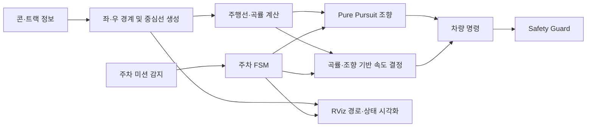

# 교내 자율주행 해커톤 — 최종 2위

[한국어](README.md) | [English](README.en.md)

> ROS 기반 자율주행 시뮬레이션에서 경로 추종, 주차 상태 머신, 안전 로직을 통합하고 고속 주행 전략을 검증한 4인 팀 프로젝트입니다. 저는 **주행·주차 제어 통합, 파라미터 튜닝, Fail-Safe 및 디버그 도구 구현**을 담당했습니다.

| 항목 | 내용 |
|---|---|
| 기간 | 2025.11.21 17:00 — 2025.11.22 10:00 |
| 결과 | 최종 2위, 주차 미션 3개 중 2개 완료 |
| 팀 구성 | 4명 |
| 역할 | 자율주행 제어 통합, 주차 FSM, 경로 추종·속도 튜닝, 검증 |
| 기술 | Python, ROS Noetic, Pure Pursuit, FSM, RViz, 자율주행 시뮬레이터 |

## 1. 프로젝트 개요

콘과 트랙 정보를 기반으로 주행 경로를 만들고, Pure Pursuit로 조향하며, 주행 상황에 맞춰 속도를 조절하는 자율주행 시스템을 구현했습니다. 일반 주행과 주차 미션을 하나의 실행 흐름으로 통합하고, 짧은 대회 시간 안에 반복 시험과 파라미터 조정이 가능하도록 상태 및 경로 시각화 기능도 구성했습니다.

대회에서는 모든 주차 미션을 천천히 완수하는 방식보다 **완료 가능한 주차 미션을 안정적으로 수행하고 일반 구간의 주행 속도를 높이는 전략**을 선택했습니다. 그 결과 주차 미션 3개 중 2개를 완료하고 최종 2위를 기록했습니다.

## 2. 기간 및 결과

- 대회 일정: 2025.11.21 17:00 — 2025.11.22 10:00
- 최종 결과: 2위
- 주차 결과: 전체 3개 미션 중 2개 완료
- 결과 증빙: 팀 수상 상장으로 확인

참가 팀 수는 독립적인 공식 자료로 확인하지 못했으므로 기재하지 않았습니다. 재현 가능한 랩타임이나 정량적인 개선율도 확보되지 않아 임의의 성능 수치를 사용하지 않았습니다.

## 3. 개발 환경

| 구분 | 사용 항목 |
|---|---|
| Runtime | ROS Noetic, Python |
| Control | Pure Pursuit, 조향각 기반 속도 제어, FSM |
| Planning | 콘 경계 기반 중심선·주행선 생성, 곡률 기반 속도 결정 |
| Validation | RViz marker, 상태 로그, 반복 시뮬레이션 |

## 4. 시스템 구조



## 5. My Contribution

### 주차 제어 통합

- 전면 주차와 평행 주차 동작을 단계별 상태 머신으로 구성
- 접근, 진입, 정렬, 정지 과정에서 상태 전환 조건과 차량 명령 연결
- 일반 주행과 주차 모드가 충돌하지 않도록 제어 흐름 통합

### 경로 추종과 속도 전략

- Pure Pursuit 기반 조향 흐름을 주행선 생성 결과와 연결
- 곡률과 조향량에 따라 속도를 바꾸도록 파라미터 조정
- 직선 구간에서는 속도를 확보하고 급격한 조향 구간에서는 안정성을 우선하도록 튜닝

### Fail-Safe와 검증 도구

- 비정상 상태에서 위험한 명령이 지속되지 않도록 Safety Guard 적용
- 중심선, Racing Line, 목표점, 조향 방향과 상태를 RViz에서 확인하도록 시각화
- 반복 시험 중 문제 상황과 파라미터 영향을 빠르게 구분할 수 있도록 디버그 정보 구성

### 기여 근거

| Commit | 확인된 파일·작업 |
|---|---|
| `a5c79ac` | `brain_final.py` 주차 로직과 상태 머신 통합 |
| `c2c9fb7` | `fsds_final.py` 주행선 최적화와 디버그 도구 통합 |
| `d284aac` | 캐시 제거 및 저장소 공개 범위 정리 |

관련 Git 기록은 [2025_HEVEN_Hackathon6](https://github.com/choiYhunn/2025_HEVEN_Hackathon6) 저장소에서 확인할 수 있습니다.

## 6. 주요 문제와 해결

| 문제 | 접근 | 확인 결과 |
|---|---|---|
| 고속 구간에서 작은 경로 오차가 큰 조향 변화로 이어짐 | 곡률·조향량에 따라 속도를 다르게 적용하고 추종 파라미터 조정 | 직선 속도와 코너 안정성의 균형 확보 |
| 주차 절차가 연속 명령만으로는 재현되기 어려움 | 동작을 명시적인 FSM 상태와 전환 조건으로 분리 | 전면·평행 주차 흐름을 반복 시험 가능하게 구성 |
| 주행 실패 원인을 수치만으로 찾기 어려움 | 목표점·경로·조향·상태를 RViz marker로 표시 | 튜닝 중 경로 생성과 제어 문제를 구분 |
| 일반 주행과 주차 제어가 동시에 명령할 가능성 | 모드별 명령 경로와 Safety Guard를 통합 | 상태별로 일관된 차량 명령 출력 |

## 7. 검증 및 결과

- 경로와 목표점, 조향 방향을 시각화하여 제어 흐름을 확인했습니다.
- 일반 주행과 각 주차 상태의 전환을 반복 시뮬레이션으로 점검했습니다.
- 대회에서 주차 미션 3개 중 2개를 완료했습니다.
- 완료 가능한 미션의 안정성과 일반 구간의 속도를 함께 확보해 최종 2위를 기록했습니다.

## 8. 파일 구성

```text
.
├─ README.md      # 한국어 포트폴리오
└─ README.en.md   # English portfolio
```

팀 코드와 개인정보가 포함된 수상 증빙 원본은 이 공개 폴더에 복사하지 않았습니다.

## 9. 한계

- 공식 랩타임과 조건별 성능 비교 자료가 없어 정량적인 속도 개선율을 제시하지 않습니다.
- 세 주차 미션 중 한 미션은 완료하지 못했습니다.
- 시뮬레이션 결과이며 실제 차량의 센서 노이즈와 구동기 지연까지 검증한 결과는 아닙니다.

## 10. Attribution

이 프로젝트는 4인 팀 활동이며, 경로 생성·시뮬레이터 환경·기존 baseline을 포함한 전체 시스템은 공동 작업과 기존 프로젝트 자산을 바탕으로 합니다. 위 Git 기록은 제가 해당 통합 파일을 작성·수정한 근거이지만 **모든 코드 라인의 단독 저작을 의미하지 않습니다**. 본 문서는 확인된 개인 기여만 구분하여 기술했습니다.
